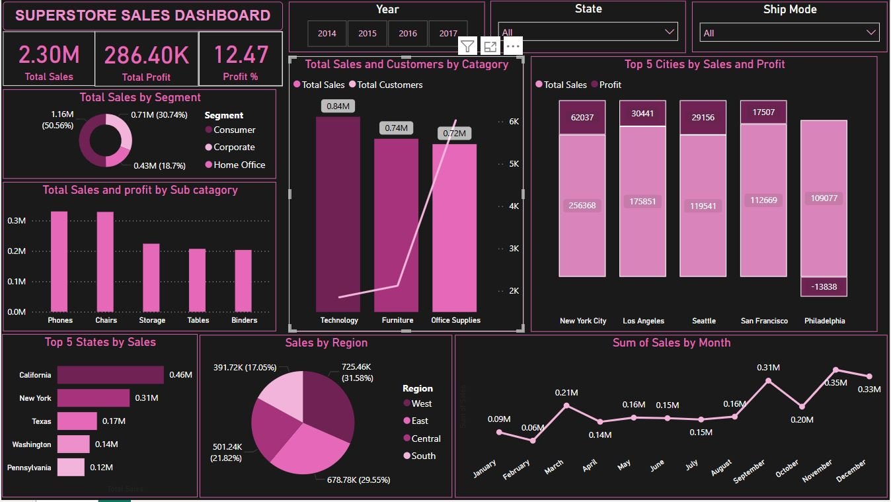

# Superstore-Sales-Data-Analysis
The objective of this project is "Create a dashboard showing sales performance by region, product,  and time period'.

This dashboard presents a visual summary of sales performance across regions, products, and time periods using:

KPI Cards for Total Sales, Total Profit, and Profit Percentage.

Donut Chart showing Total Sales by Segment (Consumer, Corporate, Home Office).

Pie Chart displaying Sales Distribution by Region (West, East, Central, South).

Bar Charts for:

Sales and Profit by Product Sub-category (e.g., Phones, Chairs).

Total Sales and Customers by Category (Technology, Furniture, Office Supplies).

Top 5 Cities and Top 5 States by Sales and Profit.

Line Chart illustrating Sum of Sales by Month to show seasonal trends.

Filters/Slicers for Year, State, and Ship Mode to enable interactive data exploration.

